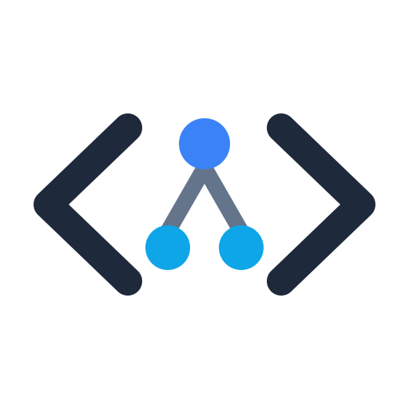

<div align="center">
  
  <h1>⚡ LeetCode Solutions</h1>
  
  <p>
    <strong>A massive collection of LeetCode solutions with detailed explanations.</strong>
  </p>

  <h3>
    👉 <a href="https://doantrunghuy.github.io/practice-interview-code">Truy cập Website Chính Thức (Live Site)</a> 👈
  </h3>
  <p>
    👤 <a href="https://leetcode.com/doantrunghuy/">Hồ sơ LeetCode của Doãn Trung Huy</a>
  </p>
</div>

---

## 🌟 Giới thiệu (About)
Đây là kho lưu trữ mã nguồn tổng hợp hơn 460+ bài tập LeetCode phục vụ cho việc ôn thi phỏng vấn lập trình, được thực hiện bởi **Doan Trung Huy**.

Thay vì phải đọc code trên GitHub, toàn bộ nội dung trong kho lưu trữ này đã được render thành một trang web giao diện cao cấp (Premium Design) với đầy đủ tính năng:
- **Tối ưu hóa đa thiết bị (Responsive):** Đọc code mượt mà trên cả điện thoại và máy tính.
- **Hỗ trợ đa ngôn ngữ:** C++, Python, SQL, Java,... với highlight syntax đẹp mắt.
- **Bố cục khoa học:** Bao gồm phần Đề bài (Description) và Code giải pháp (Solution).

🔗 **[Trải nghiệm website ngay tại đây](https://doantrunghuy.github.io/practice-interview-code)**

## 🚀 Cách chạy dự án nội bộ (Local Development)
Nếu bạn muốn đóng góp hoặc tự build lại website này trên máy cá nhân:
1. Yêu cầu hệ thống phải cài đặt `Python 3.x`.
2. Khởi chạy file script để render toàn bộ bài tập HTML:
   ```bash
   python scripts/generate_site.py
   ```
3. Khởi động server cục bộ:
   ```bash
   python -m http.server 8000
   ```
4. Truy cập `http://localhost:8000/docs/index.html` để xem trước kết quả.
